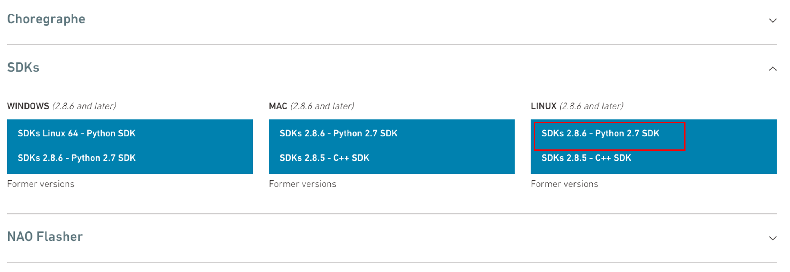

## 💻 Installation

## Download Nao Python SDK 
Download NaoQi Python SDK from: https://www.aldebaran.com/en/support/nao-6/downloads-softwares. Rename the SDK with a short name -- e.g. `python-sdk`



## Create Conda env
Use `python 2.7` for creating the environment. Nao python SDK isn't compatible with other python versions.

```
conda create -n nao python=2.7
conda activate nao
```

## NaoQi Installation
Set the following `path-variables` to install NaoQi

```
export PYTHONPATH=${PYTHONPATH}: /<path-to-python-sdk>/lib/python2.7/site-packages 
export DYLD_LIBRARY_PATH=${DYLD_LIBRARY_PATH}: /<path-to-python-sdk>/lib
export QI_SDK_PREFIX= /<path-to-python-sdk>/
```